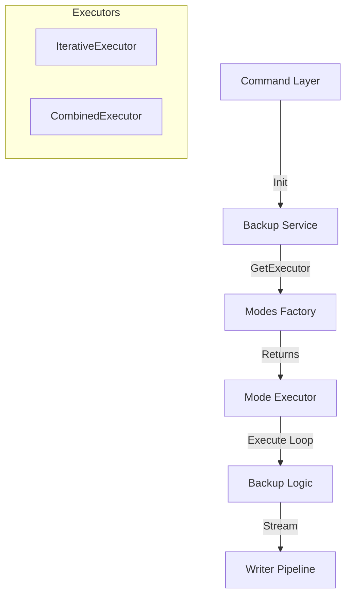

# Backup Package Documentation

**Path:** `internal/backup`  
**Status:** Production Ready  
**Refactored:** December 11, 2025 (Strategy & Factory Pattern Implementation)

## 1. Overview

Package `internal/backup` adalah inti dari logika pencadangan database pada **sfDBTools**. Package ini bertanggung jawab untuk mengorkestrasi proses backup, mengelola koneksi database, menangani streaming data (`mysqldump`), serta menerapkan kompresi, enkripsi, dan pembuatan metadata.

Arsitektur package ini telah direfaktor menggunakan **Factory Pattern** dan **Executor Pattern** untuk memastikan modularitas, kemudahan maintainability, dan prinsip *Don't Repeat Yourself (DRY)*.

---

## 2. Arsitektur & Desain

Sistem backup dibangun di atas beberapa layer utama:

1.  **Command Layer (`command.go`)**: Entry point dari CLI (Cobra). Mengambil flag, memparsing opsi, dan menginisialisasi Service.
2.  **Service Layer (`service.go`)**: Menyimpan state global (Logger, Config, DB Connection) dan menyediakan helper methods.
3.  **Execution Layer (`executor.go`)**: Menjembatani Service dengan Mode Executor yang spesifik.
4.  **Mode Layer (`modes/`)**: Mengandung logika spesifik untuk setiap jenis backup (*Single, Separated, Combined*).
5.  **IO Layer (`writer.go`)**: Menangani low-level streaming, piping, kompresi, dan enkripsi.

### Diagram Alur Kontrol



---

## 3. Komponen Utama

### 3.1. Service (`service.go`)
Struct `Service` adalah pusat dari operasi backup. Ia mengimplementasikan interface `modes.BackupService` dan menyediakan dependensi yang dibutuhkan oleh executor tanpa mengekspos detail implementasi internal secara berlebihan.

*   **Tanggung Jawab**: Manajemen koneksi DB, Logging, Error handling, Graceful Shutdown (`context` cancellation), dan pembersihan file sementara.

### 3.2. Mode Factory & Executors (`modes/`)

Logika pemilihan strategi backup dipusatkan di `internal/backup/modes`.

*   **`factory.go`**: Berisi fungsi `GetExecutor(mode, service)` yang mengembalikan executor yang sesuai berdasarkan string mode.
*   **`iterative.go` (`IterativeExecutor`)**:
    *   Menangani mode: `single`, `primary`, `secondary`, `separated`.
    *   **Logika**: Melakukan loop pada daftar database dan mem-backup satu per satu ke file terpisah.
    *   **Fitur**: Menangani penamaan file khusus untuk database utama dan generate path otomatis untuk database companion.
*   **`combined.go` (`CombinedExecutor`)**:
    *   Menangani mode: `combined`.
    *   **Logika**: Menggabungkan semua database yang dipilih ke dalam **satu file output**.
    *   **Fitur**: Melakukan capture GTID global sebelum backup dimulai.

### 3.3. Writer Pipeline (`writer.go`)

Ini adalah komponen performa tinggi yang menangani output dari `mysqldump`. Pipeline dibangun secara efisien untuk meminimalkan penggunaan memori (streaming) dan I/O disk.

**Alur Data:**
`mysqldump (stdout)` -> `Compressor (gzip/zstd)` -> `Encryptor (AES-256)` -> `Bufio (256KB Buffer)` -> `File System`

*   **Compression**: Mendukung GZIP, ZSTD, dll (via `pkg/compress`).
*   **Encryption**: Enkripsi stream *on-the-fly* sebelum data ditulis ke disk (via `pkg/encrypt`).

---

## 4. Fitur Utama

### 4.1. Metadata & Manifest
Setiap backup yang sukses akan menghasilkan file metadata (`.meta.json`) yang berisi:
*   Waktu mulai/selesai & durasi.
*   Ukuran file & throughput.
*   Versi database & mysqldump.
*   Informasi GTID & Replikasi.

### 4.2. GTID Handling (`metadata/gtid.go`)
Sistem secara otomatis mengambil posisi **Global Transaction ID (GTID)** sebelum backup dimulai. Ini krusial untuk membangun replikasi atau point-in-time recovery. File disimpan dengan suffix `_gtid.info`.

### 4.3. User Grants Export (`metadata/user.go`)
Secara default, `mysqldump` sering kali tidak menyertakan user grants secara terpisah dengan bersih. Package ini secara eksplisit mengekspor `SHOW GRANTS` untuk semua user terkait ke file `_users.sql` untuk memudahkan pemulihan hak akses.

### 4.4. Graceful Shutdown
Menggunakan `context.WithCancel` dan signal handling (`SIGINT`, `SIGTERM`). Jika user menekan `Ctrl+C`:
1.  Proses `mysqldump` dimatikan.
2.  File backup yang sedang ditulis (parsial/korup) otomatis dihapus.
3.  Koneksi database ditutup dengan aman.

---

## 5. Mode Backup

Konfigurasi mode dipusatkan di `mode_config.go`.

| Mode | Deskripsi | Executor | Output |
|------|-----------|----------|--------|
| **Single** | Backup satu DB utama (+ companion optional) | `IterativeExecutor` | File terpisah per DB |
| **Primary** | Varian Single untuk DB Utama (naming convention) | `IterativeExecutor` | File terpisah per DB |
| **Secondary** | Varian Single untuk DB Secondary | `IterativeExecutor` | File terpisah per DB |
| **Separated** | Backup banyak DB sekaligus (batch) | `IterativeExecutor` | File terpisah per DB |
| **Combined** | Backup banyak DB sekaligus | `CombinedExecutor` | **Satu file gabungan** |

---

## 6. Struktur File

```text
internal/backup/
├── command.go           # Command handlers & entry points
├── service.go           # Service struct & interface implementation
├── executor.go          # Executor initialization logic
├── writer.go            # Streaming writer (Pipe, Compress, Encrypt)
├── setup.go             # Preparation (Config check, Connection setup)
├── errors.go            # Error handling & reporting
├── helpers.go           # General utility functions
├── mode_config.go       # Centralized configuration map
├── display/             # UI Output (Tables, Spinners)
├── metadata/            # Metadata generation (JSON, GTID, Users)
└── modes/               # Backup Strategies
    ├── factory.go       # Factory Pattern implementation
    ├── interface.go     # Interfaces for Executors
    ├── iterative.go     # Logic for Single/Separated backups
    └── combined.go      # Logic for Combined backups
```

## 7. Cara Penggunaan (Code Level)

Contoh cara memanggil backup dari layer lain:

```go
// 1. Inisialisasi Service
svc := backup.NewBackupService(logger, config, options)

// 2. Siapkan Config
execConfig, _ := backup.GetExecutionConfig("single")
backupConfig := types_backup.BackupEntryConfig{
    HeaderTitle: execConfig.HeaderTitle,
    BackupMode:  "single",
    Force:       false,
}

// 3. Eksekusi
err := svc.ExecuteBackupCommand(ctx, backupConfig)
```
